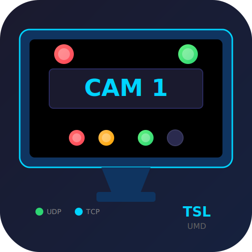

<p align="center">
  
</p>

# TSL UMD Protocol Tester

An Electron desktop application for testing and diagnosing TSL UMD (Under Monitor Display) protocol communications over UDP and TCP.

## Features

- **Protocol Support**: TSL UMD V3.1, V4.0, and V5.0
- **Server Mode**: Receive and decode incoming TSL messages
- **Client Mode**: Build and send TSL messages with visual preview
- **Transport**: UDP and TCP support for both server and client
- **Visual Tally Display**: Real-time tally lamp indicators with color support (Red, Green, Amber)
- **Interactive Controls**: Click tally indicators to set values
- **Message Logging**: Hex dump and parsed data view for all messages
- **Raw Hex Mode**: Send arbitrary hex data for testing

## Installation

```bash
npm install
```

## Usage

```bash
# Build the TypeScript
npm run build

# Start the application
npm start
```

## Protocol Overview

### V3.1 (18 bytes)
- Address (0-126)
- Tally 1-4 (on/off)
- Brightness (0-3)
- Display text (16 characters)

### V4.0 (22 bytes)
- All V3.1 features plus:
- Left/Right Display tallies with color support
- Text color tally
- Checksum validation

### V5.0 (Variable length, 16-bit)
- Screen index
- Display index
- Left/Right tally with color
- Text tally with color
- Unicode text support

## License

MIT
